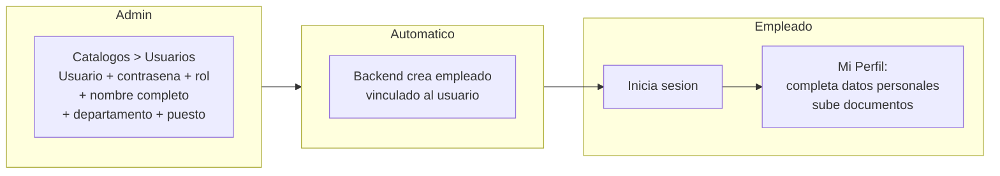
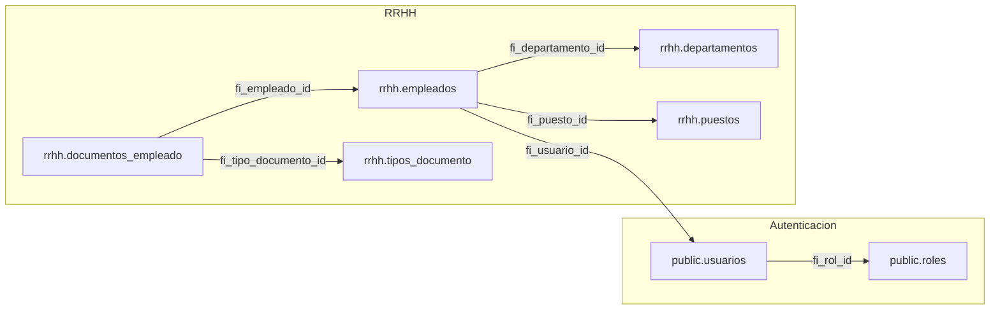

# Modulo de Empleados - Plan Unificado Definitivo

## Vision




-   
Al crear un usuario (que no sea rol root), el backend crea automaticamente un empleado vinculado con los datos basicos que el admin proporciona (nombre, apellidos, departamento, puesto)
- El empleado entra al sistema y completa su perfil: datos personales, direccion, documentos
- El admin tiene una vista RRHH > Empleados para gestionar/editar, pero ya no crea empleados desde ahi
- `public.expedientes` se elimina; los documentos se suben como archivos reales a `rrhh.documentos_empleado`
- `catalogos.estados` se elimina; el estado geografico pasa a texto libre (`fc_estado`)
- Rutas admin protegidas con `rbacMiddleware("/empleados")`

## Modelo de datos




## Decisiones de diseno

- `**fi_edad**`: NO almacenar. Se calcula desde `fd_fecha_nacimiento`.
- `**fc_estado**`: texto libre (VARCHAR), no catalogo. Misma logica que `fc_ciudad`. Reemplaza `fi_estado_id`.
- `**fc_ciudad**`: texto libre (VARCHAR), no catalogo.
- `**fn_uniformes**`: entero en `rrhh.empleados`. Frontend: "Entregado" (1) / "Sin uniforme" (0).
- `**fb_activo**`: booleano en `rrhh.empleados`, default `true`. Permite al admin desactivar empleados sin eliminarlos.
- **Campos nullable**: los campos que el empleado rellena (fc_estado, ciudad, fecha nacimiento, direccion, CP) son nullable en la BD para permitir el auto-create con datos minimos.
- `**fi_departamento_id`**: NOT NULL. El admin selecciona del catalogo via dropdown al crear usuario. Departamentos se administra como catalogo CRUD (igual que puestos).
- **Archivos**: en `./uploads/expedientes/{empleado_id}/` via multer.
- **No hay `db.sql` como migracion**: es dump de referencia. Todos los cambios se reflejan directamente ahi.

## Seguridad: RBAC en rutas

Todas las rutas de empleados y documentos usan `authMiddleware` (JWT obligatorio). Ademas, las rutas **admin** se protegen con `rbacMiddleware("/empleados")` para que solo usuarios con el modulo "Empleados" asignado puedan operar sobre datos de otros. Las rutas **self-service** quedan libres de RBAC (solo auth) porque operan exclusivamente sobre los datos del usuario logueado via JWT.

- `GET /empleados/mi-perfil` -- solo authMiddleware -- cualquier usuario logueado
- `PUT /empleados/mi-perfil` -- solo authMiddleware -- cualquier usuario logueado
- `GET /documentos-empleado/mis-documentos` -- solo authMiddleware -- cualquier usuario logueado
- `POST /documentos-empleado/mis-documentos/upload` -- solo authMiddleware -- cualquier usuario logueado
- `GET/POST/PUT/DELETE /empleados/`* (admin) -- authMiddleware + `rbacMiddleware("/empleados")` -- solo roles con modulo Empleados
- `PATCH /empleados/:id/deactivate` (admin) -- authMiddleware + `rbacMiddleware("/empleados")`
- `PATCH /empleados/:id/activate` (admin) -- authMiddleware + `rbacMiddleware("/empleados")`
- `GET/POST/DELETE /documentos-empleado/:id/`* (admin) -- authMiddleware + `rbacMiddleware("/empleados")` -- solo roles con modulo Empleados

Esto se implementa en las fases 4 y 5 (rutas de empleados y documentos respectivamente).

---

## Fase 1: Base de datos

Editar [db.sql](QualityTechnology-Backend/db.sql):

### 1.1 Eliminar `public.expedientes`

Borrar: CREATE TABLE, secuencia, DEFAULT, PK constraint, indice `idx_expedientes_nombre`.

### 1.2 Nuevas tablas

`**rrhh.puestos`** (catalogo dinamico de posiciones, con CRUD para que el admin pueda agregar/editar/desactivar puestos sin tocar codigo):

```sql
CREATE TABLE rrhh.puestos (
    fi_puesto_id INTEGER GENERATED ALWAYS AS IDENTITY PRIMARY KEY,
    fc_nombre VARCHAR(120) NOT NULL,
    fb_activo BOOLEAN DEFAULT true
);
```

`**rrhh.tipos_documento**` (catalogo de tipos de documento):

```sql
CREATE TABLE rrhh.tipos_documento (
    fi_tipo_documento_id INTEGER GENERATED ALWAYS AS IDENTITY PRIMARY KEY,
    fc_nombre VARCHAR(80) NOT NULL,
    fb_obligatorio BOOLEAN DEFAULT false,
    fb_activo BOOLEAN DEFAULT true
);
```

`**rrhh.documentos_empleado**` (archivos subidos):

```sql
CREATE TABLE rrhh.documentos_empleado (
    fi_documento_id INTEGER GENERATED ALWAYS AS IDENTITY PRIMARY KEY,
    fi_empleado_id INTEGER NOT NULL REFERENCES rrhh.empleados ON DELETE CASCADE,
    fi_tipo_documento_id INTEGER NOT NULL REFERENCES rrhh.tipos_documento,
    fc_ruta_archivo VARCHAR(500) NOT NULL,
    fc_nombre_original VARCHAR(255) NOT NULL,
    fd_fecha_carga DATE DEFAULT CURRENT_DATE,
    UNIQUE(fi_empleado_id, fi_tipo_documento_id)
);
```

### 1.3 Modificar `rrhh.empleados`

Columnas nuevas: `fi_puesto_id`, `fc_genero`, `fd_fecha_contratacion`, `fn_uniformes`, `fb_activo BOOLEAN DEFAULT true`.

Reemplazar `fi_estado_id` por `fc_estado VARCHAR(50)` (nullable, texto libre).

Campos que pasan a **nullable** (el empleado los rellena via Mi Perfil):

- `fc_estado` -- reemplaza fi_estado_id, texto libre
- `fc_ciudad` -- era NOT NULL
- `fd_fecha_nacimiento` -- era NOT NULL
- `fc_calle` -- era NOT NULL
- `fc_codigo_postal` -- era NOT NULL

Campos que se mantienen NOT NULL (admin los proporciona al crear):

- `fc_nombre`, `fc_apellido_paterno`, `fc_apellido_materno`
- `fi_departamento_id`

### 1.4 Eliminar `catalogos.estados`

Borrar de db.sql:

- `CREATE TABLE catalogos.estados`, secuencia, PK constraint, UNIQUE constraint
- FK `empleados_fi_estado_id_fkey`
- En seed de `seguridad.modulos`: cambiar "Catalogo Estados" a `fb_activo = false`

### 1.5 Seeds

- Puestos (semilla inicial, el admin puede agregar mas desde el sistema):
  - Director General
  - Director de Administracion, Finanzas y RRHH
  - Encargado de Marketing
  - Encargado de Contabilidad
  - Encargado Legal
  - Encargado de Laboratorio
  - Encargado de Bienestar Animal y Control de Patologias
  - Auxiliar de Laboratorio
  - Encargado de Taller
  - Auxiliar de Taller
  - Becario
- Departamentos (semilla inicial, el admin puede agregar mas desde el sistema):
  - Direccion General
  - Administracion, Finanzas y RRHH
  - Marketing
  - Contabilidad
  - Legal
  - Laboratorio
  - Bienestar Animal y Control de Patologias
  - Taller
- Tipos de documento (seed fijo, no administrable desde el sistema, solo modificable directamente en BD):
  - Credencial (obligatorio)
  - Fotografia (obligatorio)
  - Acta de Nacimiento (obligatorio)
  - INE (obligatorio)
  - Licencia de Conducir (opcional)
  - Comprobante de Domicilio (obligatorio)
  - RFC (obligatorio)
  - CURP (obligatorio)
  - Comprobante de Estudios (opcional)
  - CV (opcional)
  - Carta de Recomendacion (opcional)
  - Acuerdo de Confidencialidad (obligatorio)
  - Codigo de Etica (obligatorio)
  - Codigo de Conducta (obligatorio)
  - Solicitud de Empleo (obligatorio)
- Modulo "Expedientes" -> `fb_activo = false`
- Modulo "Catalogo Estados" -> `fb_activo = false`
- Agregar modulo "Puestos" con `fc_ruta = '/puestos'` al seed de `seguridad.modulos`

---

## Fase 2: Backend - Catalogos (departamentos + puestos + tipos_documento)

### Completar CRUD de departamentos

El modelo [departamentoModel.js](QualityTechnology-Backend/src/models/departamentoModel.js) ya tiene todos los metodos (`getAll`, `getActivos`, `getById`, `create`, `update`, `deactivate`). Falta exponer `update` y `deactivate` en controller y rutas:

- [departamentoController.js](QualityTechnology-Backend/src/controllers/departamentoController.js): agregar handlers `update` y `deactivate` (mismo patron que los existentes)
- [departamentoRoutes.js](QualityTechnology-Backend/src/routes/departamentoRoutes.js): agregar `PUT /:id` -> `update` y `PATCH /:id/deactivate` -> `deactivate`

### Crear puestos y tipos_documento

Crear siguiendo patron de [departamentoModel.js](QualityTechnology-Backend/src/models/departamentoModel.js):

- `src/models/puestoModel.js` + `puestoController.js` + `puestoRoutes.js`
- `src/models/tipoDocumentoModel.js` + `tipoDocumentoController.js` + `tipoDocumentoRoutes.js`
- Montar en [index.mjs](QualityTechnology-Backend/index.mjs): `/puestos`, `/tipos-documento`

---

## Fase 3: Backend - Auto-creacion de empleado al crear usuario

### 3.1 [usuarioController.js](QualityTechnology-Backend/src/controllers/usuarioController.js) `create`

El metodo `create` recibe campos adicionales y usa una **transaccion**:

```js
static async create(req, res) {
    const { nombre, contraseña, rol_id,
            fc_nombre_empleado, fc_apellido_paterno, fc_apellido_materno,
            fi_departamento_id, fi_puesto_id } = req.body;
    // 1. Validar campos base
    // 2. BEGIN transaccion
    // 3. Crear usuario -> obtener fi_usuario_id
    // 4. Consultar si rol es root (fb_es_root)
    // 5. Si NO es root: INSERT en rrhh.empleados con datos basicos + fi_usuario_id
    // 6. COMMIT (o ROLLBACK si falla)
}
```

Se requiere importar `pool` directamente en el controller (o agregar un metodo transaccional en el modelo) para manejar la transaccion.

### 3.2 [usuarioModel.js](QualityTechnology-Backend/src/models/usuarioModel.js)

El metodo `create` ya retorna `RETURNING *` con `fi_usuario_id`. No cambia.

---

## Fase 4: Backend - Empleados + Mi Perfil

### 4.1 [empleadoModel.js](QualityTechnology-Backend/src/models/empleadoModel.js)

- `getAll()`: JOINs a puestos, departamentos, usuarios. Sin JOIN a catalogos.estados. Incluir `fc_estado` como texto y todas las columnas nuevas incluyendo `fb_activo`.
- `getActivos()`: igual que getAll pero con `WHERE e.fb_activo = true`.
- `getById()`: igual con JOINs (sin estados)
- `getByUsuarioId()`: para Mi Perfil (busca por `fi_usuario_id`)
- `create()`: solo `fc_nombre`, `fc_apellido_paterno`, `fc_apellido_materno`, `fi_departamento_id`, `fi_puesto_id`, `fi_usuario_id`. Resto nullable.
- `update()`: admin puede cambiar todo (puesto, depto, uniformes, fc_estado, etc.)
- `updatePersonalData()`: self-service, solo campos personales (nombre, apellidos, genero, fecha nacimiento, direccion, fc_estado, ciudad, CP, referencias, comentarios)
- `delete()`: sin cambios
- `deactivate()`: `SET fb_activo = false` (patron de departamentoModel.js)
- `activate()`: `SET fb_activo = true`

### 4.2 [empleadoController.js](QualityTechnology-Backend/src/controllers/empleadoController.js)

- `create` validacion relajada: solo `fc_nombre`, `fc_apellido_paterno`, `fc_apellido_materno`, `fi_departamento_id` obligatorios
- `getMiPerfil`: busca por `req.user.usuario_id`
- `updateMiPerfil`: actualiza solo datos personales, validacion flexible (no exige campos que el empleado podria no haber llenado aun, solo nombre/apellidos obligatorios)
- `deactivate`: handler para `PATCH /:id/deactivate`
- `activate`: handler para `PATCH /:id/activate`

### 4.3 [empleadoRoutes.js](QualityTechnology-Backend/src/routes/empleadoRoutes.js)

```
Self-service (auth only):
  GET  /mi-perfil
  PUT  /mi-perfil

Admin (auth + rbacMiddleware("/empleados")):
  GET    /
  GET    /:id
  POST   /           (ya no se usa desde frontend, pero se mantiene por API)
  PUT    /:id
  DELETE /:id
  PATCH  /:id/deactivate
  PATCH  /:id/activate
```

NO hay endpoint `GET /usuarios-disponibles` (vinculacion automatica).

---

## Fase 5: Backend - Documentos (upload/download)

Patron: [flujoCajaRoutes.js](QualityTechnology-Backend/src/routes/flujoCajaRoutes.js).

- `src/models/documentoEmpleadoModel.js`: getByEmpleado, upsert (ON CONFLICT), delete, getById, getEmpleadoIdByUsuario
- `src/controllers/documentoEmpleadoController.js`: getByEmpleado, upload, download, delete, getMisDocumentos, uploadMiDocumento
- `src/routes/documentoEmpleadoRoutes.js`:

```
Self-service (auth only):
  GET  /mis-documentos
  POST /mis-documentos/upload

Admin (auth + rbacMiddleware("/empleados")):
  GET    /:empleadoId
  POST   /:empleadoId/upload
  GET    /download/:documentoId
  DELETE /:documentoId
```

Montar en `index.mjs`: `/documentos-empleado`

---

## Fase 6: Frontend - Rutas y menu

### [App.jsx](QualityTechnology-Frontend/src/App.jsx)

- Imports: `Empleados`, `MiPerfil`, `Puestos`, `Departamentos` (lazy). Quitar `Expedientes` y `Estado`.
- Ruta `/mi-perfil` en bloque protegido sin modulo (cualquier usuario autenticado)
- Ruta `/empleados` en bloque `<PrivateRoute modulo="RRHH">`
- Ruta `/puestos` en bloque `<PrivateRoute modulo="Catálogos">`
- Ruta `/departamentos` en bloque `<PrivateRoute modulo="Catálogos">`
- Quitar rutas `/expedientes` y `/estados`

### [CorporateLayout.jsx](QualityTechnology-Frontend/src/layout/CorporateLayout.jsx)

- "Mi Perfil" en zona general del menu (junto a Dashboard, visible para todos)
- "Empleados" en seccion RRHH
- "Departamentos" en seccion CATALOGOS (junto a Puestos, Usuarios, Roles)
- "Puestos" en seccion CATALOGOS (junto a Departamentos, Usuarios, Roles)
- Quitar "Expedientes" y "Estados"

### Nuevo componente: `Departamentos.jsx`

Pantalla CRUD para el catalogo de departamentos, en la seccion Catalogos. Mismo patron que `Puestos.jsx`:

- Formulario: nombre del departamento
- Tabla: lista de departamentos con nombre y estado (activo/inactivo)
- Acciones: crear, editar, desactivar
- Usa `GET /departamentos`, `GET /departamentos/activos`, `POST /departamentos`, `PUT /departamentos/:id`, `PATCH /departamentos/:id/deactivate`

### Nuevo componente: `Puestos.jsx`

Pantalla CRUD para el catalogo de puestos, en la seccion Catalogos. Seguir el patron de un componente CRUD existente (formulario + tabla):

- Formulario: nombre del puesto
- Tabla: lista de puestos con nombre y estado (activo/inactivo)
- Acciones: crear, editar, desactivar
- Usa `GET /puestos`, `GET /puestos/activos`, `POST /puestos`, `PUT /puestos/:id`, `PATCH /puestos/:id/deactivate`

---

## Fase 7: Frontend - Expandir Usuarios.jsx

[Usuarios.jsx](QualityTechnology-Frontend/src/components/Usuarios.jsx):

Al crear, el formulario muestra campos adicionales si el rol seleccionado NO es root:

```
[Nombre de Usuario]  [Contrasena]  [Rol]
--- si rol no es root ---
[Nombre]  [Apellido Paterno]  [Apellido Materno]
[Departamento (select)]  [Puesto (select)]
```

- Cargar catalogos: `GET /departamentos/activos`, `GET /puestos/activos`, `GET /roles`
- Para saber si un rol es root, incluir `fb_es_root` en la respuesta de `GET /roles` (verificar que el endpoint lo devuelva)
- Al enviar POST, incluir los campos de empleado en el body
- Al actualizar/eliminar usuario, el comportamiento no cambia (no se tocan datos de empleado desde aqui)

---

## Fase 8: Frontend - Empleados.jsx (solo gestion admin)

[Empleados.jsx](QualityTechnology-Frontend/src/components/Empleados.jsx):

- **Sin boton de crear** -- los empleados se crean desde Usuarios
- Tabla de empleados con indicador de "perfil incompleto" (si faltan fecha nacimiento, direccion, etc.)
- Indicador visual de activo/inactivo en la tabla
- Boton/toggle para activar/desactivar empleado desde la vista admin (`PATCH /:id/deactivate`, `PATCH /:id/activate`)
- Al seleccionar un empleado: formulario de edicion (admin puede cambiar puesto, departamento, uniformes, fc_estado como texto libre, datos personales)
- Seccion de documentos del empleado seleccionado (componente `DocumentosEmpleado.jsx`)
- Sin campo "vincular usuario" (vinculacion automatica)

---

## Fase 9: Frontend - MiPerfil.jsx (self-service)

[MiPerfil.jsx](QualityTechnology-Frontend/src/components/MiPerfil.jsx):

- Si no tiene perfil vinculado: alerta "Contacta al administrador"
- Si tiene campos vacios: banner "Completa tu perfil"
- **Datos Personales (editable)**: nombre, apellidos, genero, fecha nacimiento, calle, ciudad, estado (texto libre), CP, referencias, comentarios
- **Datos Laborales (solo lectura)**: puesto, departamento, fecha contratacion, uniformes
- **Documentos (editable)**: componente `DocumentosEmpleado` en modo self-service

Componente compartido `DocumentosEmpleado.jsx` con props: `empleadoId` o `selfService`, `readOnly`.

---

## Fase 10: Limpieza

**Backend** -- eliminar archivos de expedientes:

- `src/models/expedienteModel.js`, `src/controllers/expedienteController.js`, `src/routes/expedienteRoutes.js`
- Quitar import y `app.use("/expedientes")` de `index.mjs`
- Quitar endpoint `GET /empleados/usuarios-disponibles` y su handler

**Backend** -- eliminar archivos de estados:

- `src/models/catalogoEstadoModel.js`, `src/controllers/catalogoEstadoController.js`, `src/routes/catalogos/estado.js`
- Quitar import y `app.use("/estados")` de `index.mjs`

**Frontend** -- eliminar:

- `Expedientes.jsx`
- `Estado.jsx`

**Bruno** -- eliminar coleccion de endpoints `/estados`

---

## Fase 11: Verificacion

- `seguridad.modulos`: "Empleados" activo, "Expedientes" inactivo, "Catalogo Estados" inactivo
- CORS incluye `PATCH`
- Roles root NO generan empleado al crear usuario
- `GET /roles` devuelve `fb_es_root` para que el frontend sepa cuando mostrar campos de empleado

